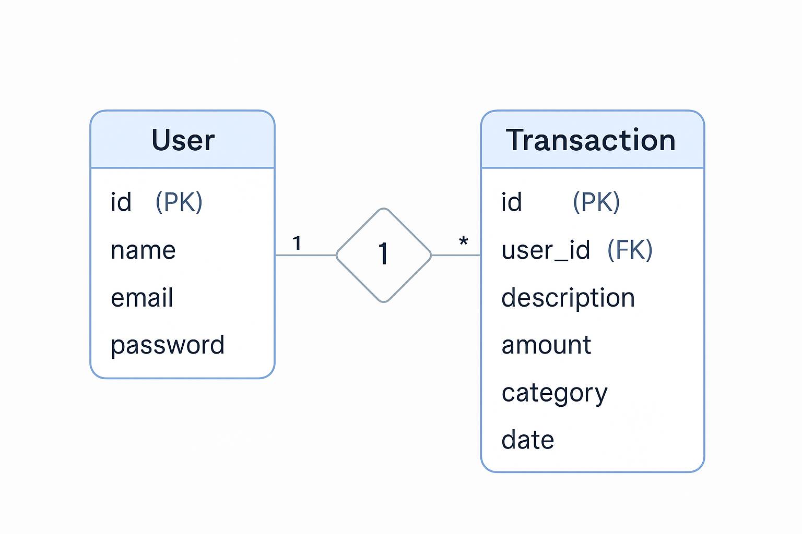

# 💸 Expense Tracker

A personal finance tracking web application that helps users manage their expenses and income. Users can securely log in, add transactions, filter by category/date, and view a pie chart summary.

---

## 🛠 Technologies Used
- React.js
- Node.js (Express)
- MongoDB
- JWT Authentication
- Tailwind CSS
- Chart.js

---

## 🚀 Setup Instructions
1. Clone the repository
2. Backend:
   - `cd backend`
   - `npm install`
   - Set up `.env` with MongoDB URI & JWT Secret
   - `npm start`
3. Frontend:
   - `cd frontend`
   - `npm install`
   - `npm start`

---

## ✨ Features
- User registration & login (JWT secured)
- Add, edit, delete transactions
- Filter by category & date
- Pie chart for expense breakdown
- Total income, expenses, and balance summary
- Fully responsive design

---


## 📊 ER Diagram

> This ER diagram shows the relationship between User and Transaction.



---

## 🌐 API Endpoints
| Method | Route                   | Description                   |
|--------|-------------------------|-------------------------------|
| POST   | `/api/auth/register`    | Register a new user           |
| POST   | `/api/auth/login`       | Login user                    |
| GET    | `/api/auth/logout`      | Logout user                   |
| GET    | `/api/transactions`     | Get all user transactions     |
| POST   | `/api/transactions`     | Add a new transaction         |
| PUT    | `/api/transactions/:id` | Update a transaction          |
| DELETE | `/api/transactions/:id` | Delete a transaction          |

---


## 🎥 Demo Video
👉 [Watch Demo](https://youtu.be/rCCtrH_Woo8)

---

## 🌐 Live App
👉 [https://expense-tracker-pz8m.onrender.com/](https://expense-tracker-pz8m.onrender.com/)


## 📦 Dummy Data for Testing

You can manually insert these transactions to test the application.

```json
[
  {
    "description": "Lunch at Subway",
    "amount": -150,
    "date": "2025-07-01",
    "category": "Food"
  },
  {
    "description": "Monthly Salary",
    "amount": 50000,
    "date": "2025-07-01",
    "category": "Salary"
  },
  {
    "description": "Bus fare",
    "amount": -50,
    "date": "2025-07-02",
    "category": "Travel"
  },
  
]
